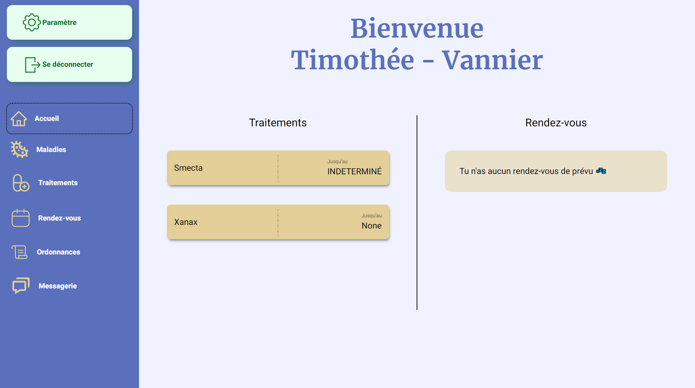

# Project : Mon carnet de santé

This project is a health book. It is a simple application that allows you to store your health data, communicate with your doctor in order to get a better health.

## Summary

- [Disclaimer](#disclaimer)
- [Installation](#installation)
  - [Dependencies](#dependencies)
  - [Environment Variables](#environment-variables)
  - [Database](#database)
- [Screenshots](#screenshots)
- [Features](#features)
- [Documentation](#documentation)
  - [Home](#home)
  - [Login_signup](#login_signup)
- [Authors](#authors)

## Disclaimer

The following installation instructions are made for a local development environment. This project might (and probably will) be deployed on a server. In this case, you won't have to install anything in order to run it.

## Installation

First of all, make sure you have python installed.
Install the dependencies with pip:

```bash
  > py -m venv env
  > pip install -r requirements.txt
  > cd health-book
```

### Environment Variables

To run this project, you will need to add the following environment variables to your .env file (in the `health-book` folder):

`DB_NAME`, `DB_USER`, `DB_PASSWORD`, `DB_HOST`, `DB_PORT`, `DB_DATABASE`, `DJANGO_SECRET_KEY`

### Database

You need to create a postgresql database. Be sure to fill up the .env file with the correct values. Then run the following command:

```bash
  > python manage.py migrate
```

### Dependencies

| Name          |Version |
| --------------|--------|
| django        | 4.0.2  |
| Pillow        | 9.0.1  |
| psycopg2      | 2.9.3  |
| python-dotenv | 0.19.2 |

## Screenshots




## Features

- Chat between doctor and patient
- Get a list of all your appointments, and prescriptions
- A doctor can block a user's chat
- Cross platform

## Documentation

This project is written in [Python](https://www.python.org/) using the [Django](https://docs.djangoproject.com) framework. It contains two apps:

- home
- login_signup

I use the BEM (Block, Element, Modifier) methodology to style the application as well as OOCSS (Object Oriented CSS) to style the components.

### Home

This app is made for all the users. It contains views for the doctor's home page, and the patient's home page. It also contains the chat between doctor and patient, and all the related views (prescriptions, diseases, treatments, etc.).

### Login_signup

This app handle the login and signup of the users both for the patient and the doctor. It contains the views for the login and signup.

## Authors

- [@redshark61](https://www.github.com/redshark61)
